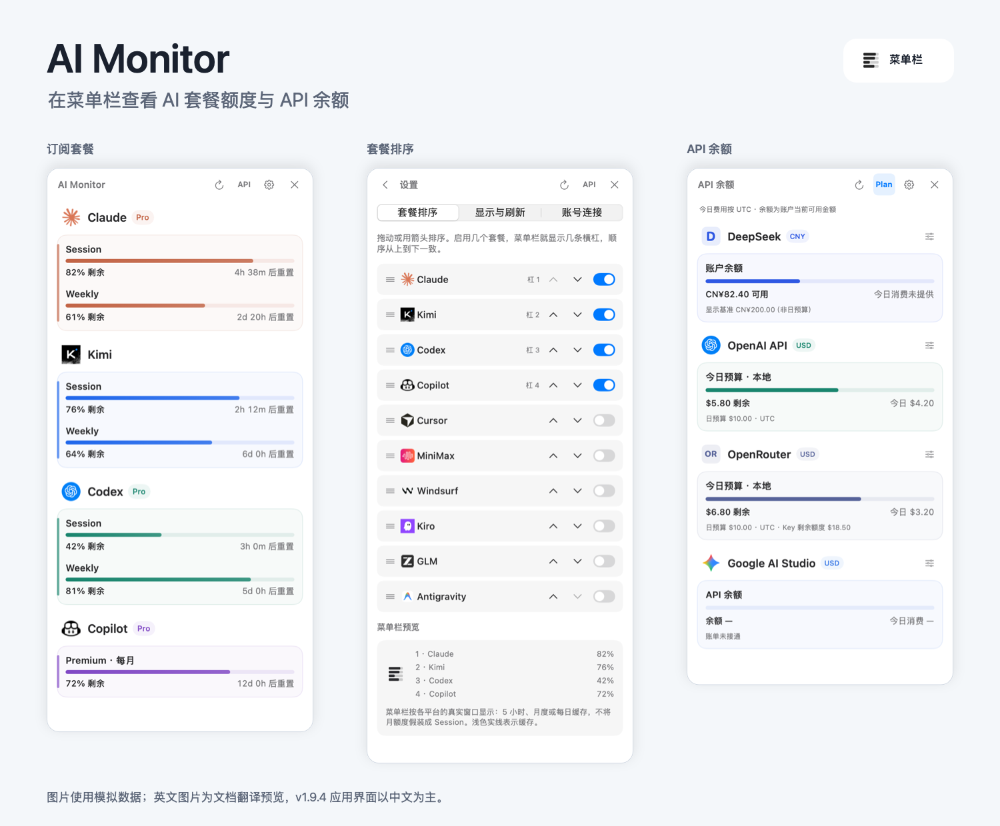
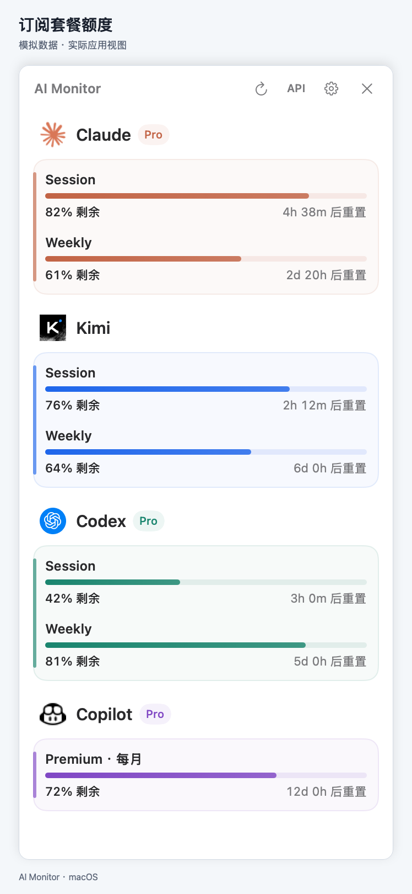
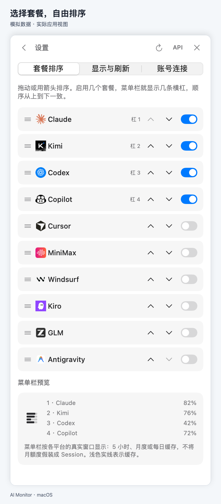
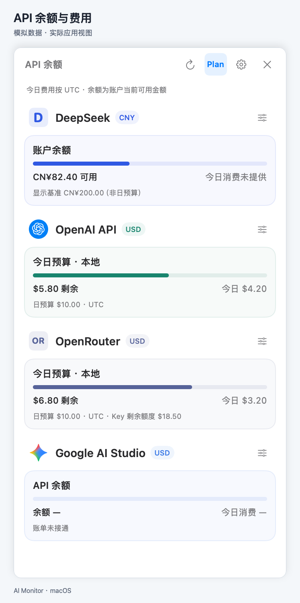

# AI Monitor

在 macOS 菜单栏，一眼查看 AI 套餐额度与 API 余额。

[English](README.md) · **简体中文** · [繁體中文](docs/i18n/README.zh-TW.md) · [日本語](docs/i18n/README.ja.md) · [한국어](docs/i18n/README.ko.md) · [Español](docs/i18n/README.es.md) · [Français](docs/i18n/README.fr.md) · [Deutsch](docs/i18n/README.de.md) · [Português](docs/i18n/README.pt-BR.md)

**[下载 Mac 版](https://github.com/Neptuneeeeeeee/AI-Monitor/releases/download/v1.9.4/AI-Monitor-v1.9.4-macos-arm64.dmg)** · [ZIP 压缩包](https://github.com/Neptuneeeeeeee/AI-Monitor/releases/download/v1.9.4/AI-Monitor-v1.9.4-macos-arm64.zip) · [版本说明](https://github.com/Neptuneeeeeeee/AI-Monitor/releases/tag/v1.9.4)

**Apple Silicon（M 系列）· macOS 14 及以上 · 已内置 Python**

打开 DMG，将 **AI Monitor.app** 拖入 **应用程序**，再到设置中选择需要显示的套餐。无需另装 Python、Xcode 或 Homebrew；部分平台仍需官方客户端及有效登录。

> **预发布版：** 尚无 Developer ID 分发签名，也未经过 Apple 公证。首次打开可能被 macOS 拦截，请先阅读[安装说明](docs/INSTALL.md)，核实来源后再决定是否打开，不要关闭系统安全保护。

*图片中的数值均为示例。当前 v1.9.4 应用界面以中文为主；英文图片是用于文档展示的翻译预览。上方语言入口只切换 README，不改变应用语言。*

## 能做什么

- 查看剩余额度与重置时间，菜单栏保持简洁黑白横杠。
- 自由选择显示的套餐，并调整顺序。
- 切换查看 API 余额或当日费用，具体取决于平台支持。

## 支持的平台

**订阅套餐:** Claude · Codex · Kimi · GitHub Copilot · Antigravity · Cursor · GLM · MiniMax · Windsurf · Kiro

**API 连接:** DeepSeek · Kimi · OpenAI · Claude · SiliconFlow · OpenRouter. Google AI Studio 仅检查访问权限，不显示数字账单.

各平台及账号可提供的数据不同。Windsurf 显示本地缓存，并非实时查询；具体限制和连接要求见[支持详情](docs/PROVIDER_CAPABILITIES.md)。

更多界面图片

[安装说明](docs/INSTALL.md) · [支持详情](docs/PROVIDER_CAPABILITIES.md) · [隐私说明](PRIVACY.md) · [更新记录](CHANGELOG.md) · [从源码构建](docs/DEVELOPMENT.md)

源码许可证尚未选定，详见[许可说明](LICENSE_PENDING.md)与[第三方声明](THIRD_PARTY_NOTICES.md)。
