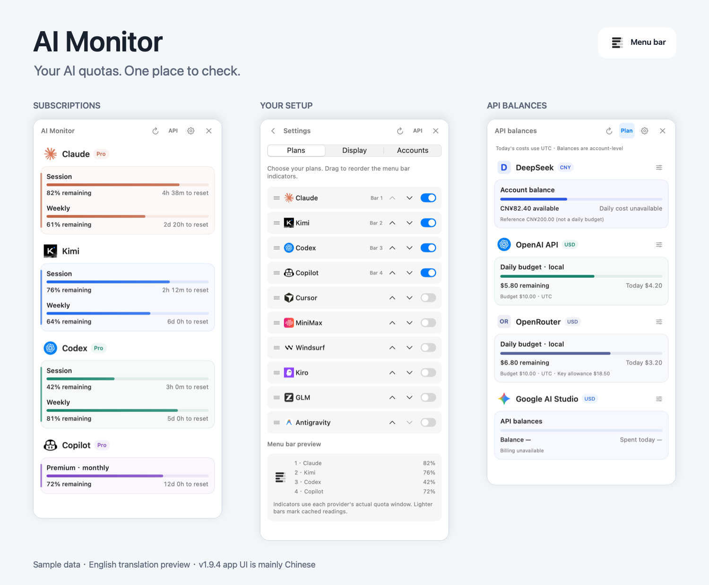
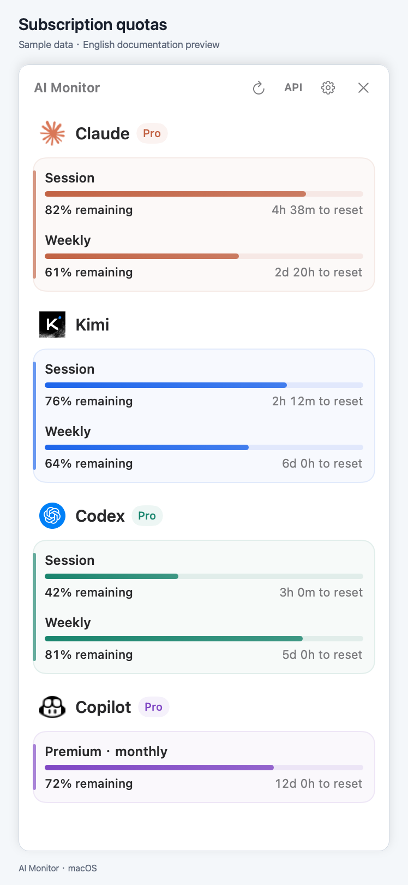
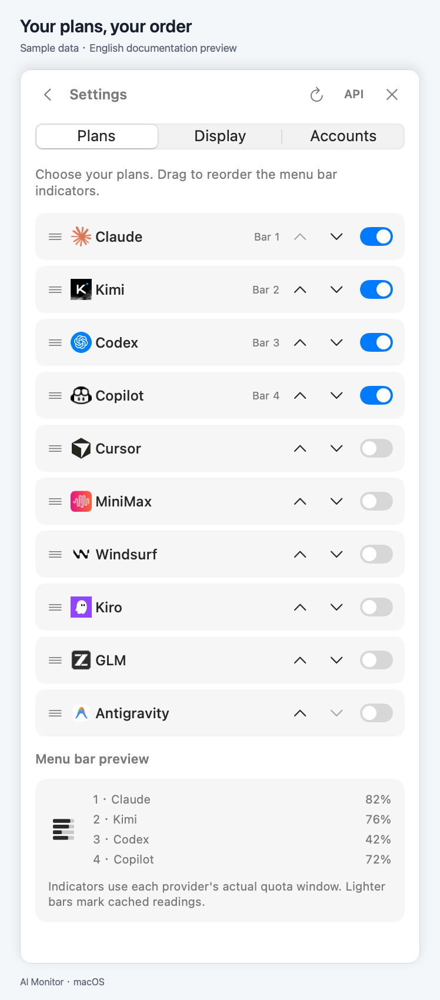
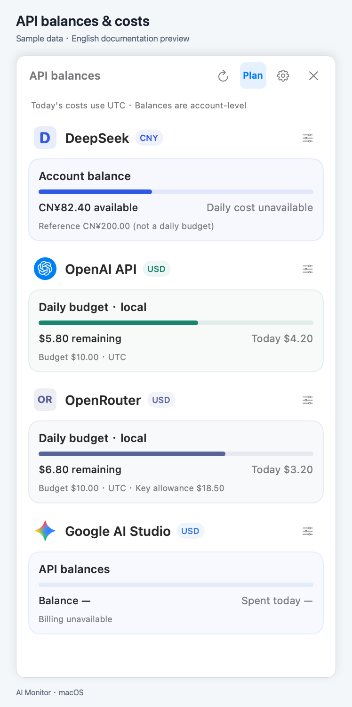

# AI Monitor

AI の利用枠と API 残高を、macOS のメニューバーで確認。

[English](../../README.md) · [简体中文](../../README.zh-CN.md) · [繁體中文](README.zh-TW.md) · **日本語** · [한국어](README.ko.md) · [Español](README.es.md) · [Français](README.fr.md) · [Deutsch](README.de.md) · [Português](README.pt-BR.md)

**[Mac 版をダウンロード](https://github.com/Neptuneeeeeeee/AI-Monitor/releases/download/v1.9.4/AI-Monitor-v1.9.4-macos-arm64.dmg)** · [ZIP 版](https://github.com/Neptuneeeeeeee/AI-Monitor/releases/download/v1.9.4/AI-Monitor-v1.9.4-macos-arm64.zip) · [リリースノート](https://github.com/Neptuneeeeeeee/AI-Monitor/releases/tag/v1.9.4)

**Apple Silicon（M シリーズ）· macOS 14 以降 · Python 同梱**

DMG を開き、**AI Monitor.app** を **アプリケーション** にドラッグして、設定で表示するサービスを選択します。Python、Xcode、Homebrew の追加インストールは不要です。サービスによっては公式クライアントとログインが必要です。

> **プレビュー版：** Developer ID による署名と Apple の公証は未実施です。初回起動時に macOS がブロックする場合があります。[インストールガイド](../INSTALL.md)を読み、配布元を確認してから起動を判断してください。システム全体のセキュリティを無効にしないでください。

*画像の数値はすべてサンプルです。v1.9.4 のアプリ画面は主に中国語で、英語画像は説明用の翻訳プレビューです。上の言語リンクは README のみを切り替えます。*

## 主な機能

- 残りの利用枠とリセット時刻を確認。メニューバーにはモノクロのバーを表示。
- 表示するプランを選択し、好きな順番に並べ替え。
- 対応サービスの API 残高や当日の費用へ切り替え。

## 対応サービス

**サブスクリプション:** Claude · Codex · Kimi · GitHub Copilot · Antigravity · Cursor · GLM · MiniMax · Windsurf · Kiro

**API 接続:** DeepSeek · Kimi · OpenAI · Claude · SiliconFlow · OpenRouter. Google AI Studio はアクセス確認のみ。残高・費用の数値表示は非対応.

取得できるデータはサービスとアカウントによって異なります。Windsurf はリアルタイムではなくローカルキャッシュを表示します。制限と接続方法は[機能一覧](../PROVIDER_CAPABILITIES.md)をご覧ください。

ほかの画面を見る

[インストール](../INSTALL.md) · [対応機能](../PROVIDER_CAPABILITIES.md) · [プライバシー](../../PRIVACY.md) · [変更履歴](../../CHANGELOG.md) · [ソースからビルド](../DEVELOPMENT.md)

ソースコードのライセンスは未選定です。[ライセンスに関する案内](../../LICENSE_PENDING.md)と[第三者の権利に関する記載](../../THIRD_PARTY_NOTICES.md)をご確認ください。
